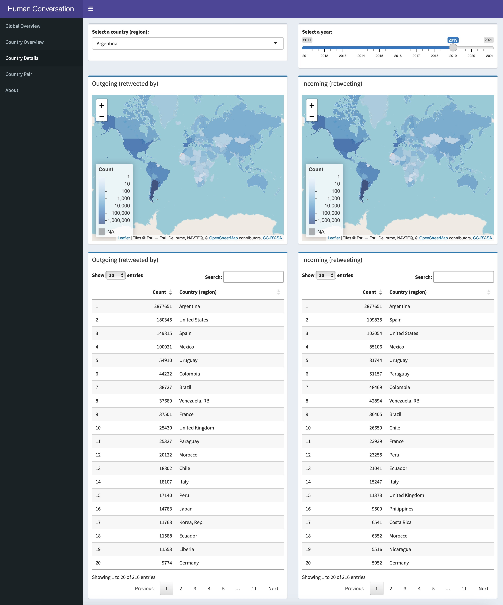

# Human Conversation Dynamics

A shiny app that visualizes human conversation dynamics based on a 10-year subscription of 1% Twitter stream.

The easiest way to use the app is simply go to here: https://zzeyu42.shinyapps.io/human_conversation_dynamics/

This will lead to a publicly hosted instance of this app. However, since I am using a free plan of the hosting service, the monthly uptime is limited. It is also easy to run it locally, especially if you're an R user (See [How to run on my local machine?](#how-to-run-on-my-local-machine) for instructions).

## What I did

1. Extracted every retweet from the 10-year Twitter dataset;
2. Used [Nominatim](https://nominatim.org) to geocode every retweeting/retweeted user's location, if available;
3. Used that location and the geographical information contained in the tweets, if available, to determine the countries (regions) of the retweets and retweeted tweets;
4. Counted the number of retweeting behaviors from each country (region) to another for every year;
5. Visualized the above information with this Shiny app.

## How to run on my local machine?

This is a Shiny app written in R. Make sure you have an installation of R on your computer, and install the packages `shiny`, `shinydashboard`, `leaflet`, `DT`, `data.table`.

After that, clone this repository, and run from the command line (replace `path-to-repo` by the path to this repository):

`R -e "shiny::runApp('path-to-repo')"`

The app is now running on your local machine. You should see a browser pop up. If not, manually copy the link given by the command line interface and open that link in a browser.

## Data sources
1. Twitter data: [Archive Team: The Twitter Stream Grab](https://archive.org/details/twitterstream)
2. Shapes of countries (regions) (stored in `data/countries.RDS` to accelerate the loading process): [World Bank Official Boundaries](https://datacatalog.worldbank.org/search/dataset/0038272/World-Bank-Official-Boundaries)